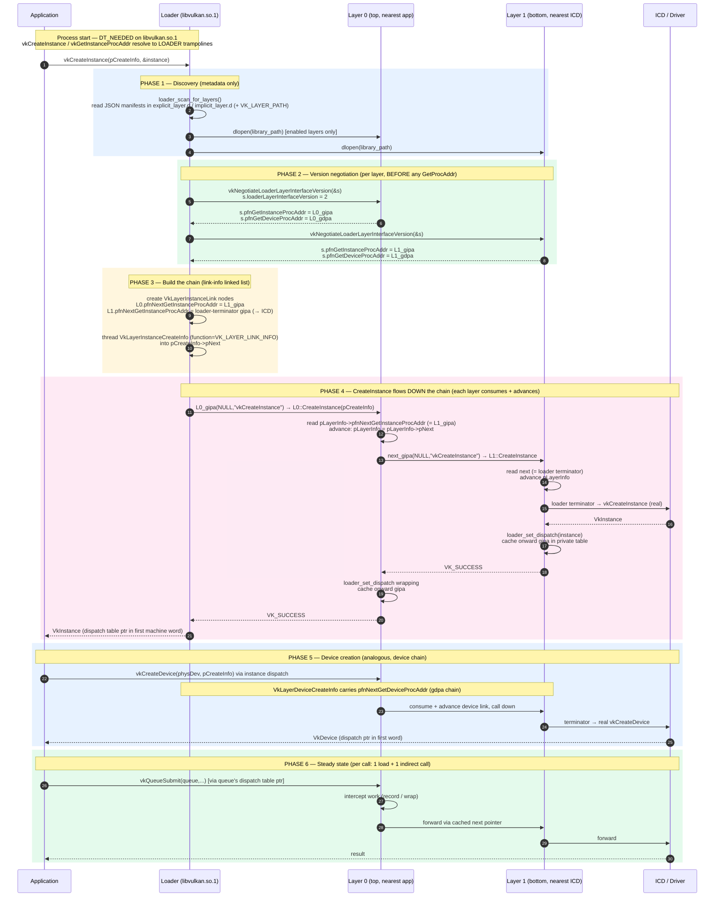

# Vulkan Loader ↔ Layer Negotiation — Full Sequence

A full Vulkan-specific sequence of the loader↔layer lifecycle: discovery, per-layer version negotiation (interface v2), chain assembly, instance/device create chaining, and steady-state dispatch. Two layers are shown so the chaining is visible.

## Details encoded above that are easy to miss

- **Negotiate happens before any `GetProcAddr`.** At interface v2 the loader takes `pfnGetInstanceProcAddr` / `pfnGetDeviceProcAddr` *out of the negotiate struct itself*; the legacy (<2) path would `dlsym` them separately.
- **The loader builds the order.** Layers do not discover their neighbors. Each layer only *consumes* its `pfnNextGetInstanceProcAddr` and *advances* `pLayerInfo = pLayerInfo->pNext` so the layer below gets its own node.
- **Instance and device chains are separate.** `gipa` flows via `VkLayerInstanceCreateInfo` / `VK_LAYER_LINK_INFO`; `gdpa` flows via `VkLayerDeviceCreateInfo`.
- **The bottom of each chain is the loader's terminator**, which dispatches into the ICD.
- **Steady-state dispatch** uses the table pointer stored in the dispatchable object's first machine word — set via `loader_set_dispatch`.
